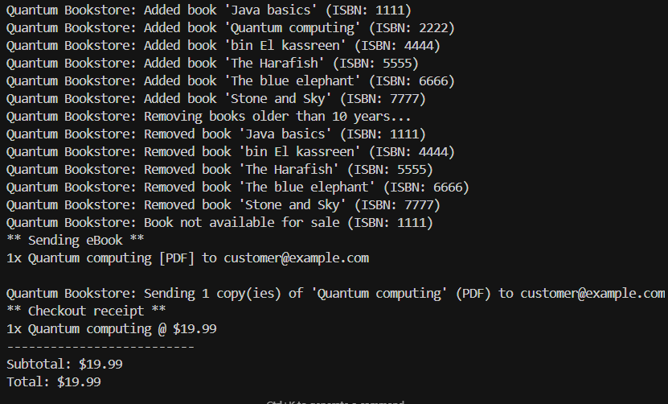

# Quantum Bookstore

Welcome to **Quantum Bookstore** – a simple, object-oriented Java simulation of a modern bookstore, where you can manage both physical and digital books, handle purchases, and even remove outdated inventory. This project is designed for learning, demonstration, or as a foundation for more advanced book management systems.

## Features

- **Inventory Management**: Add, remove, and manage books in the store.
- **Book Types**:
  - **PaperBook**: Physical books with stock tracking and shipping.
  - **EBook**: Digital books delivered via email, with file type support.
  - **ShowcaseBook**: Display-only books, not for sale.
- **Purchase Flow**:
  - Buy paper books (with shipping and stock checks).
  - Buy eBooks (delivered instantly via email).
  - Automatic error handling for unavailable or out-of-stock books.
- **Inventory Cleanup**: Remove books older than a specified number of years.
- **Extensible Design**: Easily add new book types or services.

## How It Works

The main logic is in `QuantumBookstore.java`, which manages the inventory and handles purchases. The `QuantumBookstoreFullTest.java` file demonstrates how to use the system:

- Add books to the inventory.
- Remove books older than 10 years.
- Buy a paper book and an eBook.
- Attempt to buy more books than are in stock (triggers an error).

## Getting Started

### Prerequisites

- Java Development Kit (JDK) 8 or higher.

### Running the Demo

1. **Compile the code** (from the project directory):

   ```sh
   javac *.java
   ```

2. **Run the test/demo:**

   ```sh
   java QuantumBookstoreFullTest
   ```

   You’ll see output simulating book purchases, shipping, and error handling.

## Project Structure

- `Book.java`: Abstract base class for all books.
- `PaperBook.java`: Physical book implementation.
- `EBook.java`: Digital book implementation.
- `ShowcaseBook.java`: Display-only book.
- `QuantumBookstore.java`: Main inventory and sales logic.
- `MailService.java`: Simulates sending eBooks via email.
- `ShippingService.java`: Simulates shipping paper books.
- `BookNotAvailableException.java`: Custom exception for unavailable books.
- `QuantumBookstoreFullTest.java`: Demo/test class.

##  Output

Output:



```
Quantum Bookstore: Added book 'Java basics' (ISBN: 1111)
Quantum Bookstore: Added book 'Quantum computing' (ISBN: 2222)
...
Quantum Bookstore: Removing books older than 10 years...
Quantum Bookstore: Removed book 'bin El kassreen' (ISBN: 4444)
...
** Shipment notice **
2x Java basics
Address: 123 Main St
...
Quantum Bookstore: Purchase successful. Paid: $89.99
...
Quantum Bookstore: Not enough stock for PaperBook (ISBN: 1111)
```

## Customization

Feel free to extend the system by adding new book types, services, or features!

## License

This project is for educational and demonstration purposes. 